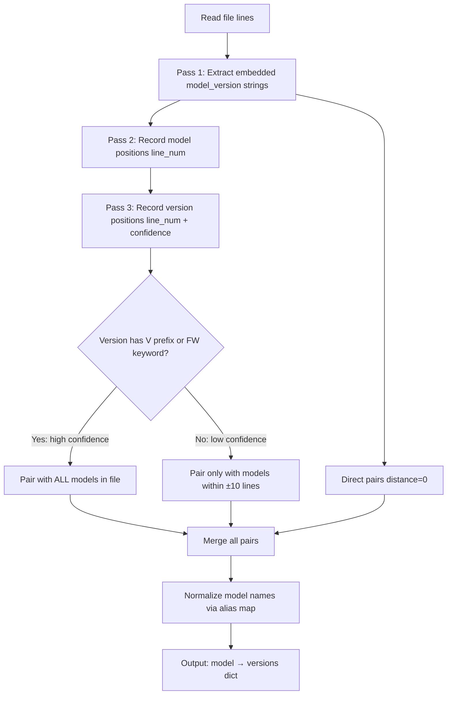

# Implementation Plan - Context-Aware Model-Version Extraction

## Problem Statement

`fw_service.py` 的 `extract_info()` 有三個核心問題：

1. 整封郵件笛卡爾積配對 — 所有型號 × 所有版本號，產生大量錯誤關聯
2. 版本 regex 只抓 2-3 段，截斷真正版本（`V5.0.1.2` → 殘片 `0.1.2`）
3. Model regex 遺漏 JWS 系列且無正規化（`EAP115a`、`JioWave62420` 未合併）

## Requirements

1. 行級配對 ±10 行：型號與版本號需在 ±10 行內才配對
2. 有 `V` 前綴或 `FW` 關鍵字的版本號 → 整封郵件全域配對（高信任度）
3. 型號嵌入字串優先提取（距離=0）
4. 版本 regex 擴展支援 4+ 段數字（`\d+\.\d+(?:\.\d+)*`）
5. 不做黑名單過濾，靠距離自然排除
6. 測試程式版本（含 `1F`）全部保留，不特別處理
7. 不做標題加權，統一距離規則
8. 擴展 model regex 加入 `JWS\d+[A-Z]?`
9. Model 正規化：建立 alias mapping 合併變體
10. 無 API 時 CLI fallback 產出帶時間戳的新 `.md`

## Background

- 郵件長度 500-3000+ 行，常含多個型號
- Model 變體：`EAP115a` → `EAP115`、`JioWave62420` → `EAP111`、`EAP104(TE)` → `EAP104`
- 版本格式：`V5.0.5.5`、`V2.2.14.261`、`EAP111-0223-WL_V5.0.5.5.1F.3.7_FDL`
- 現有 regex 截斷問題：`V5.0.1.2` → 被拆成 `0.1.2`
- `extract_info()` 被 `get_fw_summary()` 和 `get_timeline()` 呼叫
- 專案 coding convention 要求 non-AI fallback path

## Proposed Solution



## Alias Mapping

```python
MODEL_ALIASES = {
    "EAP115A": "EAP115",
    "JIOWAVE62420": "EAP111",
    "JWS62420": "EAP111",
    "EAP104L": "EAP104",
}
```

正規化規則：
- 去除尾部小寫字母後綴：`EAP115a` → `EAP115`
- 去除括號 SKU 標記：`EAP104(TE)` → `EAP104`
- 套用 alias mapping：`JioWave62420` → `EAP111`

## Task Breakdown

### Task 1: Add pytest and create test file with failing tests

**Objective:** Set up test infrastructure and define expected behavior for all new logic

**Implementation guidance:**
- Create `tests/test_fw_service.py`
- Test cases:
  - Embedded string: `"EAP111-0223-WL_V5.0.5.5.1F.3.7_FDL"` → `(EAP111, "5.0.5.5.1F.3.7")`
  - 4-segment version: `"FW V2.2.14.261"` near `"ECS4100"` → paired
  - Proximity ±10: model and version within 10 lines → paired
  - High-confidence global: `"FW V4.2.0"` 50 lines from model → still paired
  - Non-match: bare `"0.5"` 80 lines from model → NOT paired
  - Multi-model: two models in same file, each gets only its nearby low-confidence versions
  - JWS model: `"JWS2261P"` recognized and paired with nearby versions
  - Alias normalization: `"EAP115a"` → `"EAP115"`; `"JioWave62420"` → `"EAP111"`

**Test requirements:** All tests fail initially (red phase)

**Demo:** `pytest tests/` runs, shows defined test cases failing

---

### Task 2: Implement `extract_info_by_line()` with alias normalization

**Objective:** New context-aware extraction method with improved regex and model normalization

**Implementation guidance:**

Add `MODEL_ALIASES` dict and `normalize_model(name)` helper:
- Strip trailing lowercase letters: `EAP115a` → `EAP115`
- Strip parenthetical suffixes: `EAP104(TE)` → `EAP104`
- Apply alias mapping: `JioWave62420` → `EAP111`

Add `extract_info_by_line(text)` to `FWService`:

1. Split text into lines
2. **Pass 1 (embedded):** Regex `(EAP\d+|ECS\d+|AP\d+|SW\d+|JWS\d+[A-Z]?)[-_]\S*[vV](\d+\.\d+(?:\.\d+)*)` → direct pairs
3. **Pass 2 (model positions):** Regex `\b(EAP\d+\w*|ECS\d+|AP\d+|SW\d+|JWS\d+[A-Z]?|JioWave\d+)\b` → `{model: [line_nums]}`
4. **Pass 3 (version positions):** `(?:FW\s*)?[vV]\s*(\d+\.\d+(?:\.\d+)*)` for high confidence; `\b(\d+\.\d+(?:\.\d+)+)\b` for low confidence (require 3+ segments to reduce noise)
5. **Pairing:** high confidence → all models; low confidence → models within ±10 lines
6. **Normalize:** apply `normalize_model()` to all keys before returning

Return `dict[str, set[str]]`

**Test requirements:** All Task 1 tests pass

**Demo:** Tests green; manual verification with sample email

---

### Task 3: Wire into `get_fw_summary()`, `get_timeline()`, and add CLI fallback

**Objective:** Replace old logic and add standalone CLI execution

**Implementation guidance:**

- `get_fw_summary()`: replace with `extract_info_by_line(content)`
- `get_timeline()`: same replacement, normalize model names in timeline entries
- Add `if __name__ == "__main__"` to `fw_service.py`:
  - Run `get_fw_summary()`
  - Write to `knowledge/output/fw_summary_YYYYMMDD.md` (new file, never overwrites)
  - Print to stdout
- Remove or deprecate old `extract_info()`

**Test requirements:**
- Integration test verifying EAP111 does NOT get `0.5` / `0.1.2`
- `EAP115a` merged into `EAP115`
- `JWS2261P` appears in summary
- CLI creates timestamped file

**Demo:** `python -m src.services.fw_service` → correct `fw_summary_20260601.md`; `/api/fw/summary` returns matching results with normalized model names

---

### Task 4: Fix pipeline indexing gap (Hotfix)

**Objective:** Ensure all existing `.md` files are indexed in SQLite, not just those processed from `.msg`

**Root Cause:** `pipeline_service.py` only calls `insert_doc()` during `.msg` → `.md` conversion. If `.md` already exists (converted externally or before pipeline was built), it is skipped and never indexed. This caused DB to have only 4 docs while 44 `.md` files existed.

**Implementation:**
- Add `_reindex_existing()` to `pipeline_service.py`: scans `knowledge/md/` and inserts any `.md` not yet in DB
- Called automatically at end of `run_pipeline()`
- `force_reindex=True` clears DB and re-inserts all

**Result:** `search_docs('EAP111')` now returns relevant documents; `/api/ask` endpoint functional for all models.
